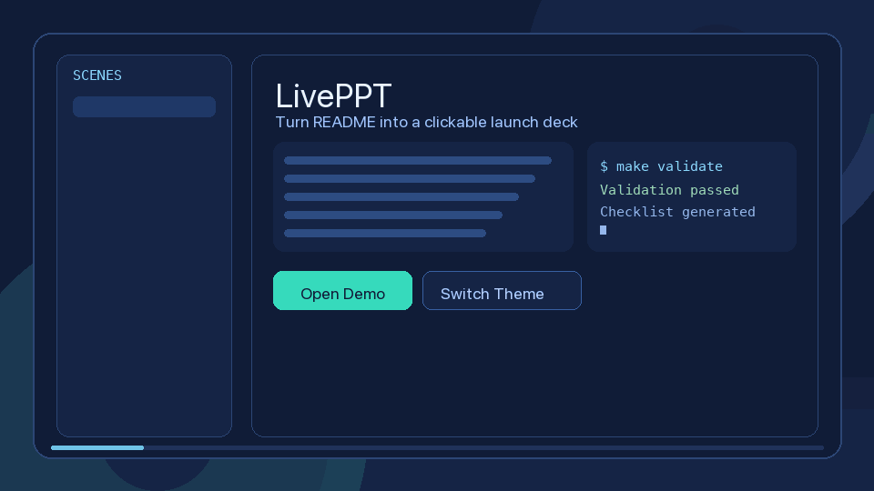

[English](README_EN.md) | **简体中文**

<div align="center">

# LivePPT

**把 README 升级为可点击、可切换主题、可发布的动态网页演示。**

[](LICENSE)
[](https://github.com/AIPMAndy/LivePPT/actions/workflows/validate-skill.yml)
[](https://github.com/AIPMAndy/LivePPT/stargazers)



</div>

---

## 为什么选 LivePPT

| 能力 | 静态 PPT | 普通 README | **LivePPT** |
|------|:--------:|:-----------:|:-----------:|
| 点击切屏 + 键盘控制 | ⚠️ | ❌ | ✅ |
| 一套内容多主题切换 | ❌ | ❌ | ✅ |
| 发布会叙事分镜 | ⚠️ | ⚠️ | ✅ |
| 脚本化生成工作流 | ❌ | ❌ | ✅ |
| 开源发布配套文档 | ⚠️ | ⚠️ | ✅ |

## 30 秒快速开始

```bash
git clone https://github.com/AIPMAndy/LivePPT.git
cd LivePPT
make validate
```

### 现在已支持：一条命令生成 HTML 演示页

最短路径：

```bash
make build-showcase \
  PROJECT="AI 产品发布网页演示" \
  AUDIENCE="技术决策者" \
  STYLE=neo-luxury \
  BRAND="LivePPT" \
  PLAN=plans/implementation-checklist.md \
  OUTPUT=dist/index.html
```

然后直接打开：

```bash
open dist/index.html
```

如果你想拆成两步，也可以：

```bash
python3 scripts/generate_showcase_plan.py \
  --project "AI 产品发布网页演示" \
  --audience "技术决策者" \
  --style "neo-luxury" \
  --output plans/implementation-checklist.md

python3 scripts/render_plan_to_html.py \
  plans/implementation-checklist.md \
  --output dist/index.html \
  --theme neo-luxury \
  --brand "LivePPT"
```

本地打开现成示例 Demo：

```bash
cd demos/liveppt-promo
python3 -m http.server 4188
# open http://localhost:4188
```

## 核心能力

- `scripts/build_showcase.py`：一条命令生成 plan + 输出 HTML 演示页。
- `scripts/generate_showcase_plan.py`：生成阶段执行清单。
- `scripts/render_plan_to_html.py`：把 Markdown 计划直接渲染成可翻页 HTML 演示页，支持主题与品牌参数。
- `scripts/add_theme.py`：快速生成主题 token CSS。
- `scripts/generate_release_note.py`：生成 release note 草稿。
- `scripts/generate_demo_gif.py`：生成可用于 README 的动态预览 GIF。
- `scripts/generate_distribution_pack.py`：生成多平台首发分发文案包。
- `scripts/validate_skill.py`：校验必需文件 + 脚本 smoke test。
- `assets/templates/starter`：可复用 starter（React/Vite）。

## 常用命令

```bash
# 校验
make validate

# 一条命令生成 plan + HTML
make build-showcase \
  PROJECT="AI 产品发布网页演示" \
  AUDIENCE="技术决策者" \
  STYLE=neo-luxury \
  BRAND="LivePPT" \
  PLAN=plans/implementation-checklist.md \
  OUTPUT=dist/index.html

# 用现成 markdown 直接生成 HTML
make render-html PLAN=examples/sample-launch-plan.md OUTPUT=dist/index.html STYLE=cyber-pulse BRAND="LivePPT"

# 手动两步：先生成 plan，再渲染为 HTML
python3 scripts/generate_showcase_plan.py \
  --project "AI 产品发布网页演示" \
  --audience "技术决策者" \
  --style "neo-luxury" \
  --output plans/implementation-checklist.md
python3 scripts/render_plan_to_html.py \
  plans/implementation-checklist.md \
  --output dist/index.html \
  --theme neo-luxury \
  --brand "LivePPT"

# 生成主题
python3 scripts/add_theme.py \
  --name midnight-luxe \
  --bg "#09090b" \
  --surface "#15151a" \
  --text "#f4f4f5" \
  --accent "#d4af37" \
  --motion "cubic-bezier(0.22, 1, 0.36, 1)" \
  --output themes/midnight-luxe.css

# 生成下个版本说明模板
make release-note VERSION=v0.1.3

# 生成 README 动态预览图
make demo-gif

# 生成分发文案包
make distribution-pack VERSION=v0.1.3
```

## 能力边界（当前版本）

当前这版已经支持：
- `一条命令生成 plan + 单文件 HTML deck`
- 一级标题生成封面
- 二级标题生成分页
- 段落 / 列表自动映射为页面正文和要点
- 品牌名、封面副标题、主题参数
- 键盘翻页、底部导航、进度条

当前还没有完全自动化的部分：
- 复杂卡片布局自动识别
- 多主题编译和模板智能匹配
- 一键导出完整静态站资源包
- 把任意 README 无损转成高保真发布会页面

## 场景

- 开源项目发布：把更新日志讲成 6-10 屏发布故事。
- B 端售前演示：同一内容切换成 `neo-luxury` / `prism-command` 等不同风格。
- 课程或知识讲解：用分镜控制节奏，降低信息噪音。

## 路线图

- `v0.1.x`：工作流、脚本、文档和 CI 已稳定。
- `v0.2.0`：补齐 Lighthouse 与响应式质量门禁。
- `v0.3.0`：推进社区模板生态与外部贡献。

详情见 [ROADMAP.md](ROADMAP.md)。

## 开源文档

- [SKILL.md](SKILL.md)
- [CONTRIBUTING.md](CONTRIBUTING.md)
- [CHANGELOG.md](CHANGELOG.md)
- [OPEN_SOURCE_LAUNCH_CHECKLIST.md](OPEN_SOURCE_LAUNCH_CHECKLIST.md)
- [releases/v0.1.2.md](releases/v0.1.2.md)
- [releases/distribution-pack-2026-03-03.md](releases/distribution-pack-2026-03-03.md)

## License

`MIT + Additional Terms`（附加条款）。

- 中文条款：`LICENSE`
- 英文条款：`LICENSE_EN.md`

---

如果这个项目对你有帮助，欢迎点一个 **Star**，或提一个 Issue 告诉我你最想要的模板能力。
